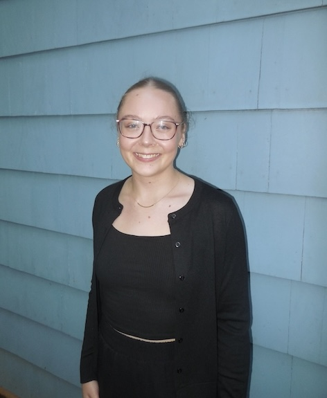

## Get to know me!
**My name is Claire and I'm in my fifth year of physics 🔭 and neuroscience 🧠**

### Why am I enrolled in this class?
I've taken a couple python courses other years but I haven't been a big fan of how they were structured and a lot of what they taught didn't stick. I figured where this is a lab class, it'll be more hands on and since it's a neuroscience course I think it'll be a lot more interesting than the other python courses I've taken.

### What got me interested in neuroscience?
I started off my undergrad as a physics major but after my second year I wasn't super happy in the program. One of my roommates at the time was in neuroscience and would tell me about what she was learning in classes. I found everything she told me to be really interesting. She encouraged me to take some neuroscience classes so I decided to double major and have thoroughly enjoyed it ever since. 

### My post graduation plans
Ultimately I want to work in healthcare but I'm not entirely sure what kind of work I want to do. I plan on applying to masters programs and I have two paths I'm considering at the moment:
1. A masters in epidemiology - this is definitely my first choice for when I graduate
2. A masters in medical physics - I'm doing my honours project with a medical physicist so I figured if I enjoy the research it could be a good idea to apply for medical physics as well to keep my options open

<!--
**claire-davis/claire-davis** is a ✨ _special_ ✨ repository because its `README.md` (this file) appears on your GitHub profile.

Here are some ideas to get you started:

- 🔭 I’m currently working on ...
- 🌱 I’m currently learning ...
- 👯 I’m looking to collaborate on ...
- 🤔 I’m looking for help with ...
- 💬 Ask me about ...
- 📫 How to reach me: ...
- 😄 Pronouns: ...
- ⚡ Fun fact: ...
-->
